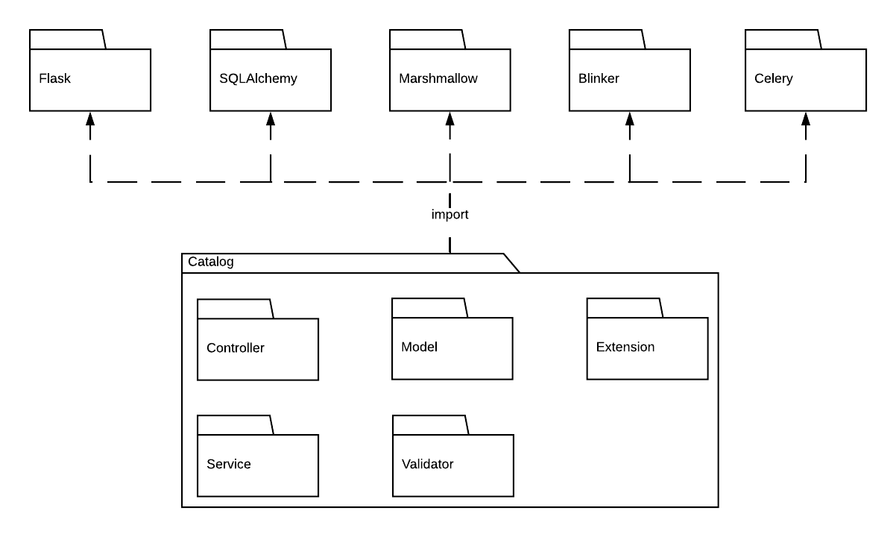
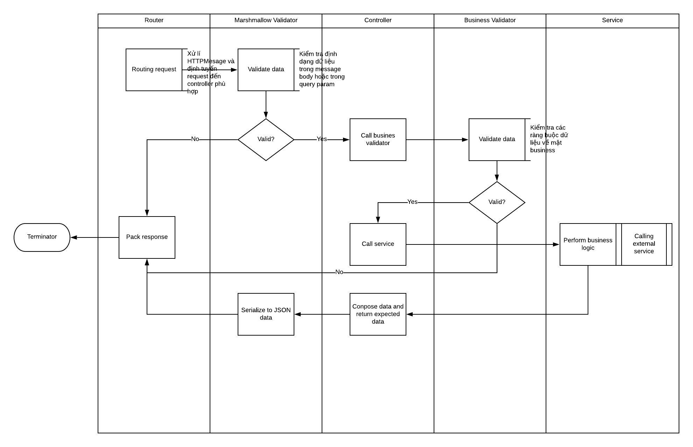
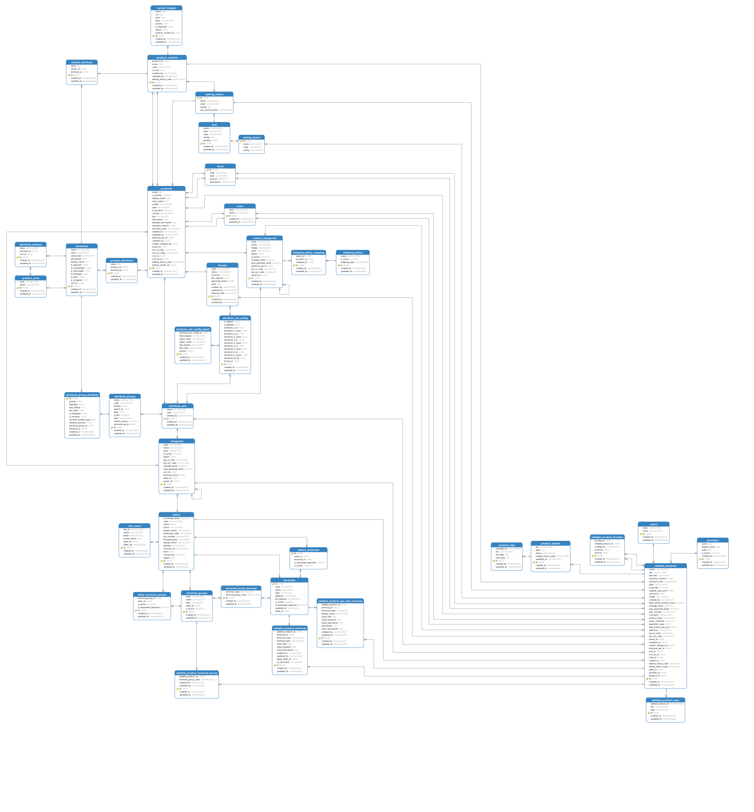
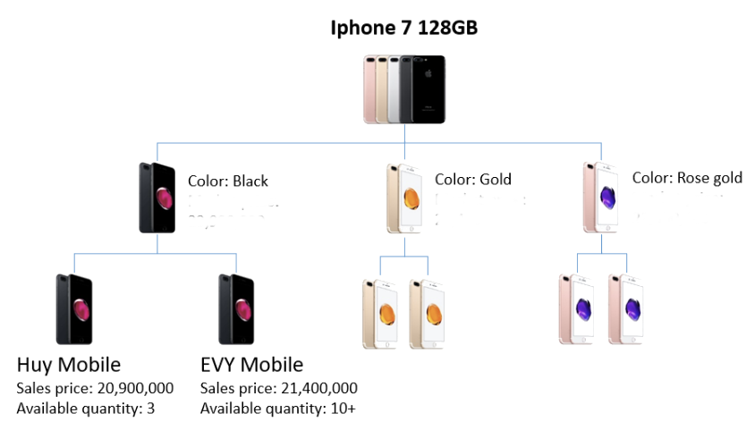

# Catalog documentation
---

## Kiến trúc nội tại hệ thống

### Cấu trúc cây thư mục

Hệ thống sử dụng một số thư viện:

- [Flask](askhttps://www.palletsprojects.com/p/flask/) : web framework cho routing
- [SQLAlchemy](https://www.sqlalchemy.org/) SQLAlchemy: ORM database framework
- [Marshmallow](https://marshmallow.readthedocs.io/en/stable/) Marshmallow: serialize and deserialize high level object to json format
- [Blinker](https://pythonhosted.org/blinker/) Blinker: broadcast signaling for Python objects
- [Celery](http://www.celeryproject.org/) Celery: framework cho background job

Cấu trúc hệ thống:

- API: thực hiện việc routing data trong request đến các module liên quan
        trong API bao gồm các các Schema cho việc serialize và deserialize data
        API đóng vai trò caller, các module khác (service, validator) đóng vai trò là callee

- Validator: thực hiện các business validate khi request truyền lên, nếu dữ liệu không hợp lệ sẽ sinh ra exception
- Service: thực hiện các thao tác business, tương tác trực tiếp đến database hoăc các hệ thống khác
- Model: tương tác với hệ quản trị cơ sở dữ liệu, ánh xạ data từ database sang Python object
- Extension: Mở rộng chức năng các thư viện bên ngoài cho phù hợp với yêu cầu của dự án

### Workflow

### Database model

### Quản lí resource

#### 1. Sản phẩm

Mô hình quản lí sản phẩm được phân cấp thành 3 layer

- Layer 1 - Product
Đây là layer trừu tượng nhất chứa thông tin cơ bản nhất của 1 sản phẩm, phục vụ chủ yếu cho người quản lí hệ thống và seller. Mục đích chủ yếu dùng để gom nhóm sản phẩm mà seller có thể bán.

- Layer 2 - Variant
Đây là layer dùng để xác định cụ thể từng thuộc tính của sản phẩm, seller chủ yếu thao tác trên layer này

- Layer 3 - Sellable product
Đây là layer gán trực tiếp với từng seller. SKU được gán ở layer này như là một đối tượng có thể bán và tồn tại trong kho hàng.

#### 2. Master category

Danh mục quản lí dành cho sản phẩm layer 1.  Danh mục này do người quản lí hệ thống quản lí các sản phẩm có trên hệ thống.
Cấu trúc danh mục là cấu trúc cây. Một danh mục có thể là danh mục lá hoặc không, nếu một danh mục không có con ở trạng thái hiệu lực thì danh mục đó là danh mục lá. Mỗi danh mục được có với một bộ thuộc tính. Mỗi sản phẩm chỉ thuộc 1 danh mục lá và danh sách thuộc tính của sản phẩm này được xác định bằng bộ thuộc của danh mục đó

#### 3. Danh mục sản phẩm

Mỗi danh mục sản phẩm được gán với 1 seller cụ thể, resource này có cấu trúc cây. Danh mục lá là danh mục không có con ở trạng thái hiệu lực. Chỉ các danh mục lá mới được làm danh mục của sản phẩm ở layer 3

#### 4. Thương hiệu

Thương hiệu được gán vào sản phẩm ở layer 1

#### 5. Hệ thống thuộc tính sản phẩm

Hệ thống quản lí thuộc tính dựa trên mô hình [Entity - attribute - value](https://en.wikipedia.org/wiki/Entity%E2%80%93attribute%E2%80%93value_model)

Bộ thuộc tính là tập hợp các thuộc tính có liên quan với nhau để mô tả 1 loại mặt hàng. Giữa bộ thuộc tính và thuộc tính có một lớp trung gian là nhóm thuộc tính. Nhóm thuộc tính gom các thuộc tính liên quan về phương diện nào đó.

Ví dụ loại mặt hàng về laptop có một bộ thuộc tính riêng. Ta sẽ nhóm các thuộc tính liên quan đến màn hình vào một nhóm, trong nhóm màn hình có thể có thuộc tính kích thước, độ phân giải, số lượng màu hiển thị,...

Thuộc tính có thể là một trong 4 loại: text, number hoặc selection hoặc multiple selection

## Các hệ thống liên quan bên ngoài

#### 1. Listing

#### 2. File

#### 3. User

#### 4. Seller

### Hệ thống background job xử lí file

### Hệ thống message queue để đồng bộ dữ liệu các bên

